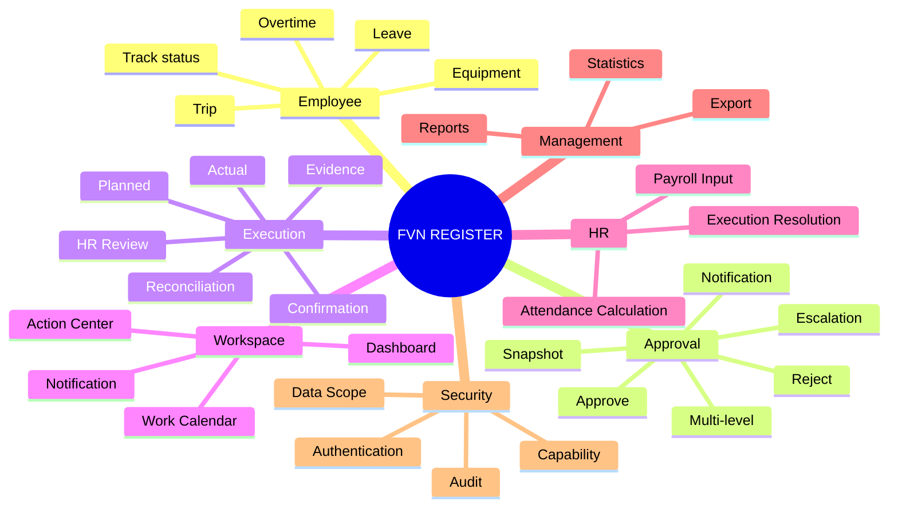
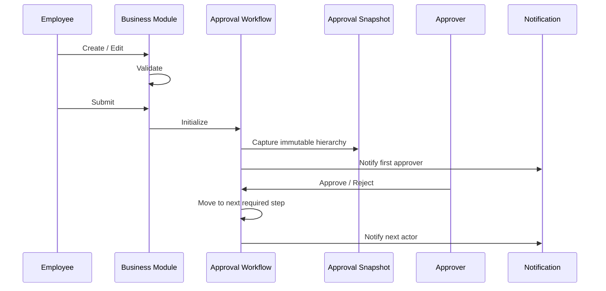
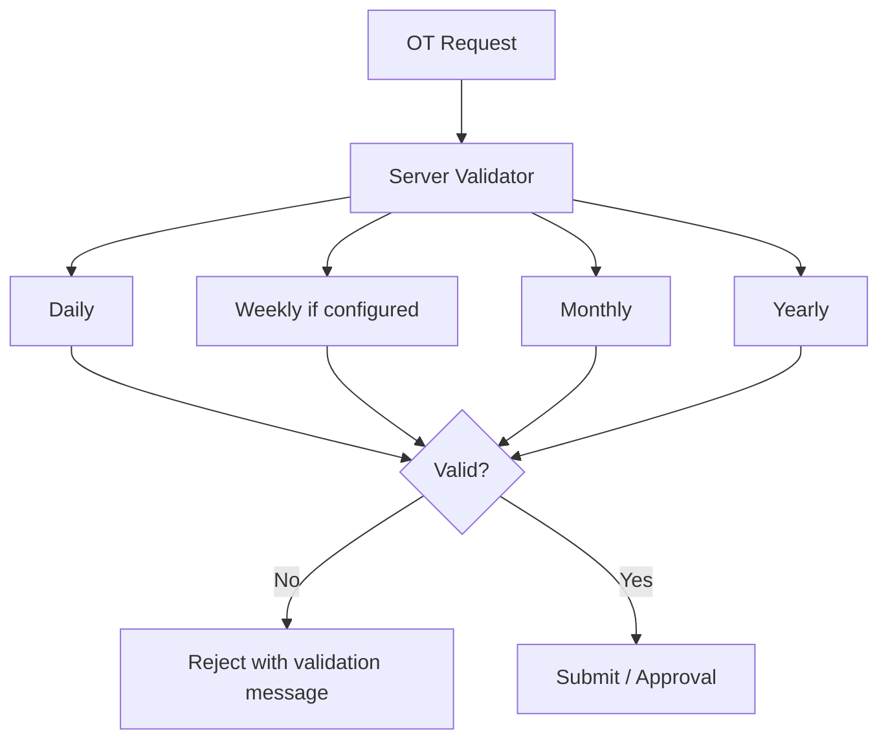
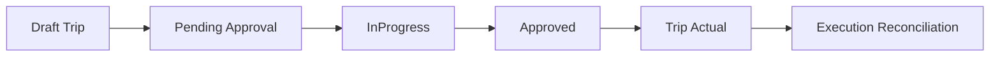
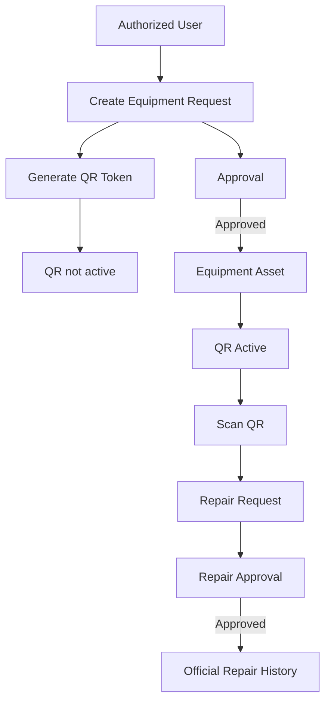
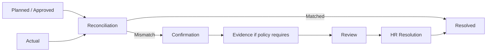
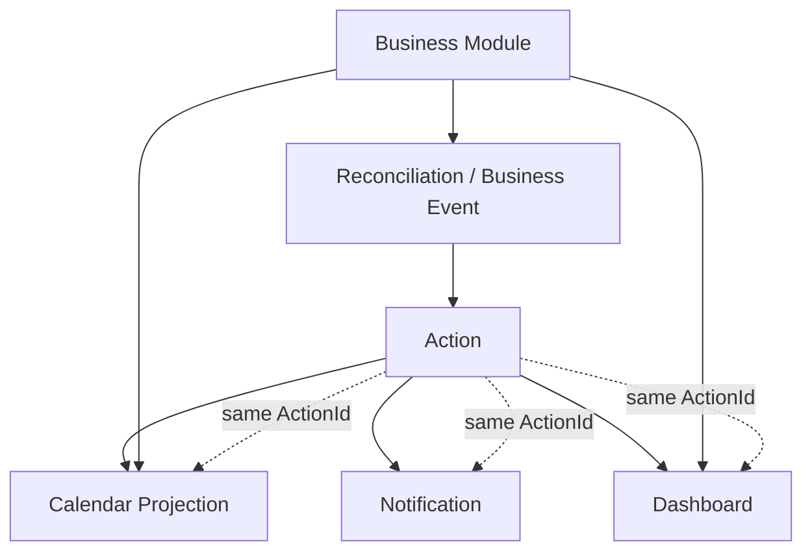
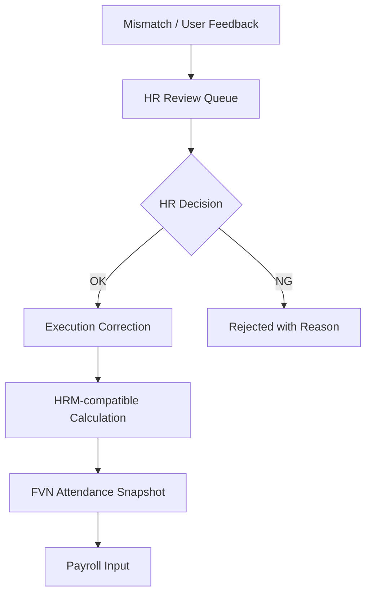
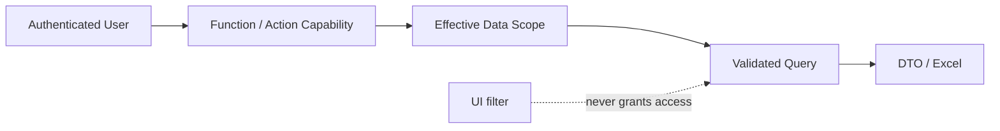

# FVN REGISTER — TỔNG QUAN TÍNH NĂNG

## 1. Bản đồ tính năng

## 2. Request & Approval

Approval timeout escalation là system decision `Escalated`, không đồng nghĩa `Rejected`.

## 3. Leave

- Request và approval.
- Balance.
- Lịch nghỉ đã duyệt.
- Calendar.
- Reports.

## 4. OT

Hạn mức phải lấy từ policy/rule hiện hành; Weekly chỉ áp dụng khi có rule cấu hình. Không hard-code hạn mức trong UI.

## 5. Trip

Trip sử dụng approval engine chung.

## 6. Equipment + QR

Module access và approval authority là hai lớp khác nhau.

## 7. Execution Reconciliation

Reconciliation là framework dùng chung cho OT, Leave, Trip và module tương lai.

## 8. Action / Calendar / Notification

- Action = công việc.
- Calendar = projection/navigation.
- Notification = delivery/read state.
- Dashboard = aggregation.
- Business module = source of truth.

## 9. HR Review & Attendance

HR không sửa trực tiếp kết quả attendance snapshot. Correction phải đi qua calculation pipeline.

## 10. Reports

Danh mục chính: Leave, OT, Trip, Equipment và Attendance. Export là capability riêng và luôn bị giới hạn bởi Data Scope.

## 11. Security

Scope chuẩn: Own, Employee, Department, All. Quyền Approve không tự động có Scope All.
