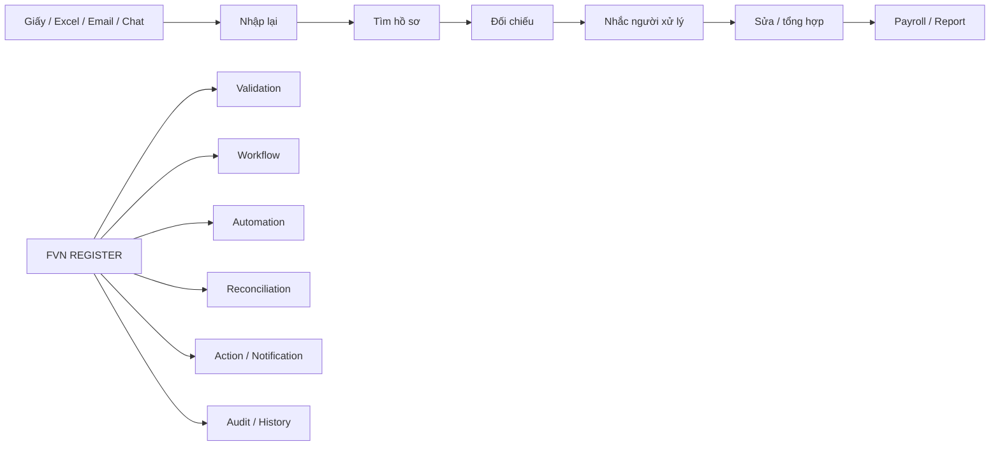
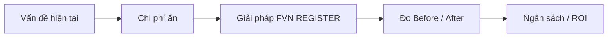
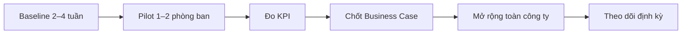

# FVN REGISTER — PR, GIỚI THIỆU VÀ BUSINESS CASE

## 1. Product statement

> **FVN REGISTER — Smart Employee Request, e-Approval & Operational Control Platform**

FVN REGISTER là nền tảng tập trung cho đăng ký nghiệp vụ, phê duyệt điện tử, theo dõi thực tế, đối soát, quản lý thiết bị, checklist, báo cáo và kiểm soát công việc.

Điểm khác biệt là nối toàn bộ vòng đời:

**Request → Approval → Planned → Actual → Reconciliation → Action → Resolution → Reporting / Payroll**

## 2. Business value

| Giá trị | Tác động |
|---|---|
| Giảm giờ công thủ công | Ít nhập lại, ít tìm hồ sơ, ít tổng hợp Excel |
| Giảm chi phí giấy tờ | Giảm in, scan, lưu trữ và luân chuyển hồ sơ |
| Giảm rework | Validation + workflow + reconciliation phát hiện sai lệch sớm |
| Giảm việc bị quên / quá hạn | Notification, reminder, Action, escalation |
| Tăng khả năng truy vết | Snapshot, History, Evidence, Resolution |
| Giảm thời gian báo cáo | Dashboard / Reports / Export theo scope |
| Quản lý tài sản tốt hơn | QR + lịch sử sửa chữa + checklist + evidence |

## 3. Before / After

## 4. Equipment & Checklist

**Equipment Request → Approval → Asset + QR → Assignment → Scheduled Task → Reminder → Inspection → Evidence → Approval → History / Report**

Giá trị gồm QR, import Excel staging/validation, schema theo phòng ban, checklist version, lịch định kỳ, task, reminder, evidence và Action Center.

## 5. Business case

### Giảm giờ công

`HoursSaved = (Transactions × MinutesSavedPerTransaction + MonthlyReportingHoursSaved) / 60`

`LaborValue = HoursSaved × LoadedLaborCostPerHour`

### Giảm chi phí giấy tờ

`PaperSaving = Printing + Scan + Filing + Storage + InternalTransport`

### Giảm chi phí rework

`ReworkSaving = BaselineReworkCost - PostGoLiveReworkCost`

### Tổng lợi ích

`AnnualBenefit = LaborValue + PaperSaving + ReworkSaving + RiskAvoidance`

`ROI = (AnnualBenefit - AnnualRunCost) / TotalInvestment`

> Không trình “% tiết kiệm” như kết quả đạt được nếu chưa có baseline/pilot.

## 6. Cách trình Ban lãnh đạo

Bắt đầu bằng baseline thực tế: giờ công, số hồ sơ, thời gian đối chiếu, checklist trễ, thời gian lập báo cáo, chi phí tìm lịch sử và số issue trước payroll.

## 7. KPI pilot

| KPI | Baseline | After |
|---|---:|---:|
| Minutes / request | Đo thực tế | So sánh |
| HR minutes / request | Đo thực tế | So sánh |
| Approver minutes / request | Đo thực tế | So sánh |
| Manual touches / request | Đo thực tế | So sánh |
| Report preparation hours | Đo thực tế | So sánh |
| Checklist on-time % | Đo thực tế | So sánh |
| Rework % | Đo thực tế | So sánh |
| Missing history | Đo thực tế | So sánh |
| Payroll exception rate | Đo thực tế | So sánh |
| Digital adoption rate | Đo thực tế | So sánh |

## 8. Adoption & rollout

**Measure first → Pilot → Prove → Scale**

## 9. Kết luận truyền thông

### FVN REGISTER

**Một nền tảng. Một quy trình. Một nơi để theo dõi.**

Không chỉ “không dùng giấy”, mà là giảm công việc lặp lại, giảm thời gian kiểm tra, giảm lỗi, giảm việc quên hạn, tăng khả năng truy vết và tạo dữ liệu quản trị.
