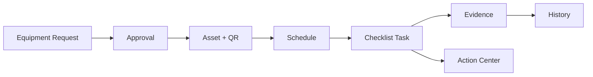

# FVN REGISTER
## TỪ HỒ SƠ → QUẢN TRỊ VÒNG ĐỜI CÔNG VIỆC

**Request → Approval → Planned → Actual → Reconciliation → Action → Resolution → Reporting / Payroll**

---

# 01 — MỘT LUỒNG DỮ LIỆU

Từ nhập liệu và theo dõi thủ công sang một vòng đời có trạng thái, audit và trách nhiệm rõ ràng.

---

# 02 — PHÉP • OT • CÔNG TÁC

**Đăng ký → Duyệt → Kế hoạch → HRM/Thực tế → Đối soát → Xử lý ngoại lệ**

- Planned và Actual không bị trộn.
- Approval Snapshot bảo toàn lịch sử quyết định.
- Mismatch trở thành case/action thay vì phải tự tìm bằng Excel.

---

# 03 — WORK CALENDAR & ACTION

Một ngày có thể cho thấy:

**Company Calendar → Shift → Attendance → Registration → Issue/Action → Registration Opportunity**

`Calendar` là projection/navigation; business module vẫn là source of truth.

`?` là marker của vấn đề cần xử lý, không phải business request mới.

---

# 04 — EQUIPMENT & CHECKLIST

QR, schema/import Excel, checklist định kỳ, sửa chữa, bàn giao, evidence và lịch sử được quản lý trong cùng vòng đời.

---

# 05 — ENDPOINT & COMPLIANCE

Agent cung cấp bằng chứng inventory; không tự thay đổi allowlist và không có remote command channel.

---

# 06 — SECURITY

**Capability = được làm gì?**  
**Data Scope = được làm trên dữ liệu nào?**

UI không cấp quyền. Server kiểm tra capability và scope trước dữ liệu, command và export.

---

# 07 — GIÁ TRỊ QUẢN TRỊ

- Giảm nhập lại và tổng hợp Excel.
- Phát hiện sai lệch sớm.
- Có người xử lý và deadline rõ ràng.
- Lưu snapshot, evidence, history và audit.
- Dashboard/Report/Payroll dùng nguồn dữ liệu thống nhất.

> **Một nền tảng. Một quy trình. Một nơi để theo dõi.**
