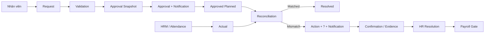
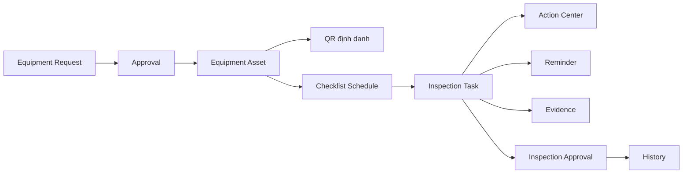
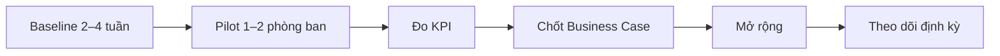

# FVN REGISTER — BUSINESS CASE, COST REDUCTION & MANAGEMENT VALUE

> Mục đích: tài liệu dùng cho Ban lãnh đạo đánh giá hiệu quả đầu tư số hóa và tác động đến chi phí vận hành.

> **Nguyên tắc:** mọi số %/giờ/chi phí minh họa không phải số liệu thực tế. Khi lập ngân sách chính thức, thay bằng baseline đo thực tế trong 2–4 tuần.

## 1. Executive message

FVN REGISTER chuyển chuỗi:

**Đăng ký → Phê duyệt → Thực tế → Đối chiếu → Nhắc việc → Xử lý sai lệch → Lưu lịch sử → Báo cáo**

từ các thao tác rời rạc sang một quy trình có dữ liệu, rule, automation và lịch sử tập trung.

## 2. Bốn nhóm giá trị

| Nhóm | Cơ chế |
|---|---|
| Giảm giờ công thủ công | Giảm nhập lại, tìm hồ sơ, đối chiếu Excel, tổng hợp báo cáo, nhắc người xử lý |
| Giảm chi phí giấy tờ | Giảm in, scan, lưu trữ và luân chuyển hồ sơ |
| Giảm rework / sai sót | Validation, workflow, reconciliation và audit trail |
| Giảm rủi ro vận hành | Reminder, escalation, QR, checklist, evidence và payroll readiness gate |

“Giảm giờ công” trước hết là giải phóng năng lực; chỉ trở thành tiết kiệm tiền mặt khi doanh nghiệp thực sự giảm chi phí hoặc tái phân bổ nguồn lực hiệu quả.

## 3. Luồng thống nhất

## 4. Equipment & Checklist

Giá trị gồm import Excel staging/validation, schema theo phòng ban, checklist version, lịch định kỳ, task, reminder, evidence và lịch sử.

## 5. Công thức business case

### Giảm giờ công

`HoursSaved = (N × (E + A + H) + R) / 60`

Trong đó N là số giao dịch/tháng; E/A/H là phút tiết kiệm của Employee/Approver/HR; R là phút tiết kiệm báo cáo.

`LaborValue = HoursSaved × LoadedLaborCostPerHour`

`AnnualLaborValue = LaborValue × 12`

### Chi phí giấy tờ

`AnnualPaperSaving = PrintedForms + Copy/Scan + Filing/Storage + InternalTransport`

### Rework

`ReworkSaving = BaselineReworkCost - PostGoLiveReworkCost`

### Tổng lợi ích và ROI

`AnnualBenefit = LaborValue + PaperSaving + ReworkSaving + RiskAvoidance`

`ROI = (AnnualBenefit - AnnualRunCost) / TotalInvestment`

## 6. KPI pilot

| KPI | Baseline | After |
|---|---:|---:|
| Minutes / request | Đo thực tế | So sánh |
| HR minutes / request | Đo thực tế | So sánh |
| Approver minutes / request | Đo thực tế | So sánh |
| Manual touches / request | Đo thực tế | So sánh |
| Report preparation hours | Đo thực tế | So sánh |
| Checklist on-time % | Đo thực tế | So sánh |
| Rework % | Đo thực tế | So sánh |
| Missing history | Đo thực tế | So sánh |
| Payroll exception rate | Đo thực tế | So sánh |
| Digital adoption rate | Đo thực tế | So sánh |

## 7. Rollout

**Measure first → Pilot → Prove → Scale**
