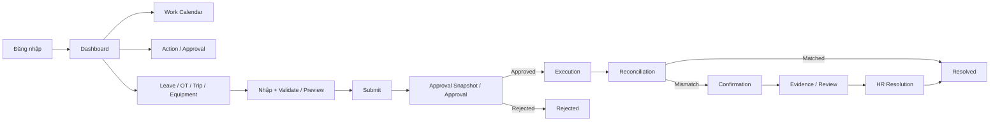
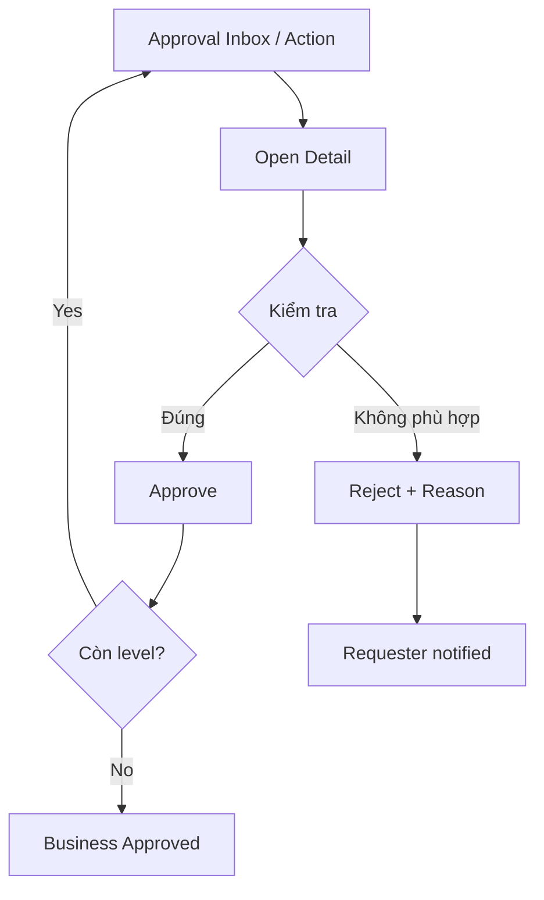
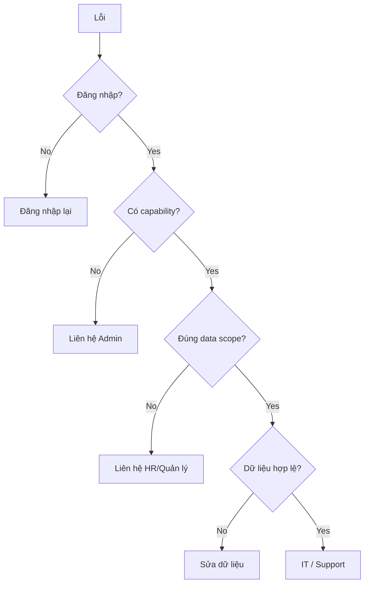

# FVN REGISTER — HƯỚNG DẪN SỬ DỤNG

## 1. Luồng sử dụng chung

## 2. Đăng nhập và Dashboard

1. Đăng nhập bằng tài khoản được cấp.
2. Kiểm tra Dashboard, Notification và Action.
3. Nếu không thấy module/chức năng, liên hệ Admin/HR để kiểm tra capability và data scope.
4. Không chia sẻ mật khẩu hoặc token.

Dashboard chỉ tổng hợp dữ liệu theo quyền; thao tác nghiệp vụ phải thực hiện ở module nguồn.

## 3. Tạo request

1. Mở Leave, OT, Trip hoặc Equipment.
2. Nhập dữ liệu.
3. Kiểm tra validation/hạn mức/file nếu có.
4. Preview.
5. Submit.
6. Theo dõi trạng thái trong module, Dashboard, Notification hoặc Calendar.

Sau Submit, Approval Snapshot giữ hierarchy tại thời điểm gửi. Thay đổi approver về sau không tự sửa lịch sử của request đã Submit.

## 4. Phê duyệt

`Escalated` do timeout không đồng nghĩa Rejected. Approver chỉ thao tác trên request thuộc required step và data scope của mình.

## 5. Leave

**Create → chọn loại phép → chọn ngày → kiểm tra balance → Preview → Submit → theo dõi Approval.**

Leave Approved mới là planned business state dùng cho reconciliation. Half-day được xử lý theo day value/loại buổi; không coi half-day là full-day conflict.

## 6. OT

**Create → chọn ngày/giờ → kiểm tra limit → Preview → Submit → Approval → Actual → Reconciliation.**

Hạn mức được kiểm tra server-side theo policy hiện hành. Approved OT là Planned; Actual lấy từ attendance/calculation chính thức.

## 7. Trip

**Create → nhập khoảng ngày/nội dung → Preview → Submit → Approval → Execution/Actual → Reconciliation.**

Trip dùng approval workflow chung và dữ liệu source riêng; Calendar chỉ hiển thị projection.

## 8. Equipment

**Create → tạo QR → Submit → Approval → Asset/QR Active → Scan → Repair Request → Repair Approval → Repair History.**

Được cấp quyền dùng Equipment không tự động có quyền approve. QR có thể được tạo trước nhưng chỉ có hiệu lực nghiệp vụ sau khi request được duyệt.

## 9. Work Calendar

Calendar là màn hình theo ngày, gồm Company Calendar, Shift, Attendance, Registration, Issues/Actions và Registration Opportunity.

### Click một ngày

- **Detail:** mở request/business detail.
- **Confirmation:** mở case mismatch/action để xử lý.
- **Registration:** mở form Leave/OT/Trip với ngày đã chọn.
- **Info:** chỉ xem thông tin.

### Ngày tương lai

Không có attendance thực tế ở ngày tương lai là bình thường. Calendar có thể hiển thị request đã đăng ký cùng trạng thái như Pending/Approved/Rejected theo dữ liệu source.

### Dấu `?`

`?` là marker của **Issue**, không phải request và không phải ActionId. Click marker để xem issue và các ActionOption.

### Ca và ký hiệu chấm công

**Ca (`C1/C2/C3/HC/...`) lấy từ HRM**, cụ thể từ kết quả `F03HrmAttendanceCalculated`. Calendar không tự suy ra lại ca từ In/Out.

Phần ký hiệu Work/OT được tạo bởi Calendar Symbol Rules. Rule dùng DayType + Shift + khoảng In/Out/OT + block để tạo ký hiệu; thay đổi Rule được thực hiện ở màn hình quản trị Rule, không sửa code UI.

Nguyên tắc DayType:
- Thứ 7 nghỉ công ty → `T`.
- Chủ nhật → `CN`.
- Lễ quốc gia → `NL`.
- Thứ 7 đi làm bình thường, không phải ngày nghỉ công ty → vẫn classification ngày thường và màu lịch ngày thường.

OT dùng block 15 phút theo Rule. Ví dụ C1 `05:49 → 14:05` không sinh `K0.25`; nếu phần OT trong OT window chỉ 5 phút và Rule dùng FLOOR 15 phút thì OT = 0. C1 `05:47 → 18:05` cho phần OT chuẩn 4 giờ → `K4`.

### Ký hiệu kíp 12 giờ

Rule hỗ trợ split Work/OT, ví dụ:

| Ngày | Kíp | Ký hiệu |
|---|---|---|
| T7 nghỉ công ty | 06:00–18:00 | `T8` + `TK4` |
| T7 nghỉ công ty | 10:00–22:00 | `T28` + `T4` |
| T7 nghỉ công ty | 18:00–06:00 | `T38` + `TK4` |
| CN | 06:00–18:00 | `CN8` + `CNK4` |
| CN | 10:00–22:00 | `CNC28` + `CN4` |
| CN | 18:00–06:00 | `CNC38` + `CNK4` |
| Lễ | 06:00–18:00 | `NL8` + `NLK4` |
| Lễ | 10:00–22:00 | `NLC28` + `NL4` |
| Lễ | 18:00–06:00 | `NLC38` + `NLK4` |

Ký hiệu lẻ được tính theo block Rule; Rule có thể tách phần Work và OT. Ví dụ kíp 06:00–18:00 làm 11h45 trên T7 → `T7.75 + TK4`, không gộp thành `T11.75`.

### Dấu `?` và OT

`?` là trạng thái reconciliation/action, không phải một phần của symbol. Vì vậy có thể thấy `C3 + K4 + ?`: `C3` từ HRM Shift, `K4` từ Symbol Rule, còn `?` do Execution Reconciliation xác định khi Actual OT chưa có Approved OT tương ứng.

## 10. Action / Confirmation / Notification

- **Action:** việc cần người dùng xử lý.
- **Confirmation:** bước xác nhận mismatch.
- **Notification:** thông báo/delivery.

Hoàn thành Action không tự thay đổi business result. Xử lý mismatch phải đi qua reconciliation workflow.

## 11. HR Review và Evidence

Khi mismatch yêu cầu review, người dùng có thể được yêu cầu xác nhận, nhập lý do hoặc gửi evidence. Evidence có lifecycle riêng. Reject/NeedMoreEvidence không làm reconciliation tự động Resolved.

HR correction không sửa trực tiếp attendance snapshot; correction phải đi qua calculation pipeline theo thiết kế.

## 12. Reports và Export

Reports hỗ trợ Leave, OT, Trip, Equipment và Attendance theo data scope. **View và Export là hai capability độc lập.** Bộ lọc trên UI không mở rộng quyền truy cập server.

## 13. Khi gặp lỗi

Khi báo lỗi: ghi module, request code nếu có, thời điểm, thao tác ngay trước lỗi và ảnh màn hình. Không gửi password/token.

## 14. Execution Reconciliation — kết quả HR, xác nhận và khiếu nại

Khi một mismatch đã được HR xử lý, **HR Resolution không mặc định đồng nghĩa đóng vụ việc**. Nếu policy yêu cầu nhân viên xác nhận, hệ thống tạo một Action mới cho nhân viên.

**Nhân viên:**
- **Chấp nhận** → vụ việc chuyển Resolved.
- **Khiếu nại** → hệ thống kiểm tra policy, giới hạn số vòng appeal và yêu cầu evidence mới nếu có; sau đó chuyển case về HR.
- Khi đạt số vòng tối đa → case chuyển **Chờ quyết định cuối**.

**HR:** nhiều HR có thể được cấp quyền xử lý, nhưng một case chỉ có một người claim/lock để thay đổi tại một thời điểm.

**Timeout:** theo policy snapshot của case, hệ thống hoặc escalate sang final decision hoặc auto-accept kết quả HR.

**Lịch:** trạng thái Chờ nhân viên xác nhận / Đang xem xét khiếu nại / Chờ quyết định cuối đều là trạng thái cần xử lý. ActionId của reconciliation luôn trỏ tới action hiện tại.

**Payroll:** case chưa resolved vẫn là payroll-readiness blocker theo thiết kế hiện tại; không hiểu PayrollCutoffMode là tự động bỏ qua case.

## 15. Quản trị Calendar Symbol Rules

Chỉ người có capability quản trị Rule và được chỉ định làm operator (khi feature đã cấu hình operator) mới được tạo/sửa/kích hoạt Rule.

Tại màn hình quản trị Rule:
1. Chọn DayType và Shift/Pattern.
2. Khai báo từng Work/OT segment.
3. Chọn block và rounding.
4. Khai báo prefix/template và split sequence.
5. Dùng **Test Rule** với một bộ In/Out thực tế.
6. Chỉ kích hoạt sau khi kết quả test đúng.

Không sửa JavaScript/C# để thay một ký hiệu nghiệp vụ. Nếu nghiệp vụ đổi `K4`, `T8`, `CNK4`, `NL8` hoặc block/rounding, sửa Rule và kiểm thử lại.

Rule test phải được hiểu là mô phỏng; dữ liệu ca thực tế trên Calendar vẫn lấy từ HRM.

## 15. Equipment và Endpoint Agent — thao tác chuẩn

### Người dùng/nhân viên
- Mở Sổ thiết bị để xem Equipment được phép theo scope.
- Nếu được giao thiết bị, có thể xem thông tin tài sản và các thao tác được capability cho phép.
- Không tự nhập DeviceKey hoặc credential.

### IT / Endpoint Operator
1. Mở Sổ thiết bị.
2. Chọn Equipment là laptop/desktop/máy có OS.
3. Mở Endpoint Agent.
4. Kiểm tra Endpoint Agent được phép và OS family.
5. Nếu chưa bật, người có Equipment.Manage bật eligibility.
6. Chọn Cấp credential.
7. Sao chép secret một lần.
8. Cài Agent trên đúng máy và bảo vệ secret bằng DPAPI.
9. Quay lại Equipment để kiểm tra Agent status, version, LastSeen và installation identity.
10. Khi cần đổi secret, dùng Rotate credential; khi cần vô hiệu hóa, dùng Thu hồi credential.

### Không sử dụng flow cũ
Không bắt đầu bằng việc mở một form riêng và nhập DeviceKey để gắn credential vào máy. Nếu security-center còn hiển thị chức năng legacy, chức năng đó chỉ phục vụ audit/technical compatibility; Equipment vẫn là entry point nghiệp vụ.

### Các trường hợp thường gặp
| Tình huống | Xử lý |
|---|---|
| Equipment không có OS | Không bật Endpoint Agent |
| Chưa có Endpoint | Cấp credential từ Equipment, sau đó cài Agent |
| Credential hết/thu hồi | Rotate hoặc provision lại theo capability |
| Đổi người sử dụng | Không tạo DeviceKey mới |
| Cài lại Windows | Kiểm tra AgentInstallationId + hardware identity |
| Đổi tên máy | Không coi là Endpoint mới nếu identity vẫn hợp lệ |
| Secret đã mất | Không thể xem lại; rotate/provision credential mới |
