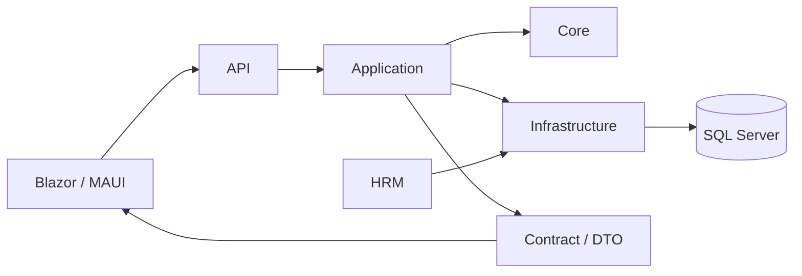

# FVN_REGISTER

FVN_REGISTER là nền tảng đăng ký nghiệp vụ nhân sự và phê duyệt điện tử, bao gồm Nghỉ phép, Làm thêm giờ (OT), Công tác, Thiết bị, Chấm công/Đối soát, Lịch làm việc, Trung tâm công việc, Thông báo, Bảng điều khiển và Báo cáo.

## Giới thiệu quản trị và business case

- **Cổng tài liệu giới thiệu:** [Bộ tài liệu Ban giám đốc](M%C3%94%20H%C3%8CNH/03_TAI_LIEU_HE_THONG/01_GIOI_THIEU/00_README.md)
- [Giới thiệu tổng thể](M%C3%94%20H%C3%8CNH/03_TAI_LIEU_HE_THONG/01_GIOI_THIEU/01_INTRODUCTION.md)
- [Trình chiếu Ban giám đốc](M%C3%94%20H%C3%8CNH/03_TAI_LIEU_HE_THONG/01_GIOI_THIEU/04_PRESENTATION.md)
- [Lợi ích theo vai trò](M%C3%94%20H%C3%8CNH/03_TAI_LIEU_HE_THONG/01_GIOI_THIEU/06_ROLE_BENEFITS.md)
- [Kịch bản demo](M%C3%94%20H%C3%8CNH/03_TAI_LIEU_HE_THONG/01_GIOI_THIEU/07_DEMO_STORYBOARD.md)

## Tài liệu sản phẩm và kỹ thuật

- **Tài liệu kiến trúc/source of truth:** [24 — Work Calendar & Action](M%C3%94%20H%C3%8CNH/24_WORK_CALENDAR_AND_ACTION_IMPLEMENTATION.md)
- **Đối soát thực tế:** [18 — Reconciliation](M%C3%94%20H%C3%8CNH/18_OT_ATTENDANCE_RECONCILIATION.md)
- **Cổng tài liệu:** [Documentation](M%C3%94%20H%C3%8CNH/DOCUMENTATION/00_INDEX.md)
- **Hướng dẫn người dùng:** [User Guide](M%C3%94%20H%C3%8CNH/DOCUMENTATION/04_USER_GUIDE.md)
- **Hướng dẫn nhanh:** [Quick Guide](M%C3%94%20H%C3%8CNH/DOCUMENTATION/05_QUICK_GUIDE.md)
- **FAQ:** [FAQ](M%C3%94%20H%C3%8CNH/DOCUMENTATION/06_FAQ.md)
- **Chuẩn tài liệu:** [Documentation Standard](M%C3%94%20H%C3%8CNH/DOCUMENTATION/08_DOCUMENTATION_STANDARD.md)

## Ranh giới kiến trúc

### Lịch làm việc chung

Nghỉ phép, OT và Công tác sử dụng góc nhìn lịch làm việc chung. Lịch là projection/navigation, không sở hữu trạng thái nghiệp vụ gốc.

- `GET /api/calendar`
- `GET /api/calendar/availability`
- UI: `WorkCalendar`
- Rule contract: `CalendarDayDto` + `ICalendarDayRule`
- Chi tiết: `MÔ HÌNH/24_WORK_CALENDAR_AND_ACTION_IMPLEMENTATION.md`

Lịch có thể tổng hợp lịch công ty, ca làm, đăng ký, trạng thái phê duyệt, vấn đề/công việc cần xử lý và khả năng đăng ký tùy quy tắc. Ngày tương lai chưa có actual attendance là bình thường.

### Báo cáo và thống kê

Báo cáo nghiệp vụ chịu kiểm soát theo capability và phạm vi dữ liệu. Quyền xem và quyền xuất dữ liệu là hai quyền riêng biệt.

### Nghỉ phép / OT / Công tác

Đây là các nghiệp vụ yêu cầu riêng với kiểm tra điều kiện, đăng ký, phê duyệt và lịch sử. Yêu cầu đã được duyệt là kế hoạch; actual được lấy từ nguồn thực tế chính thức và đối soát phù hợp.

## Cấu hình và bảo mật

API dùng `ConnectionStrings:DefaultConnection`. Không commit secret, JWT key hoặc connection string vào repository. Dùng .NET User Secrets cho development và environment/secret store cho production.
